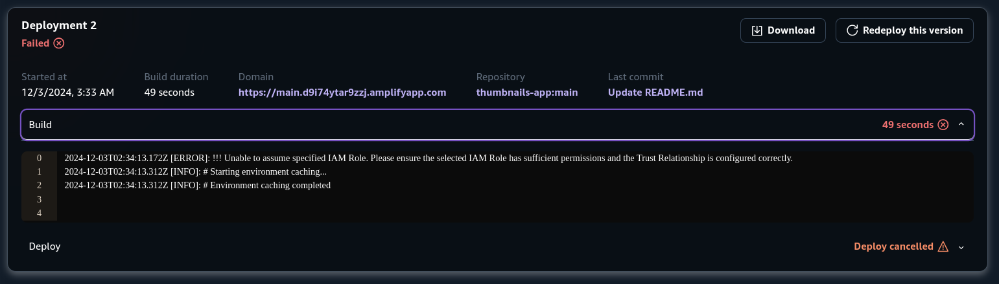

# Proyecto Thumbnails en AWS

Esta documentación describe cómo ejecutar el proyecto de generación de thumbnails en AWS.

## Configuración Inicial

1. **Crear un ambiente virtual de Python e instalar las dependencias del proyecto:**

 ```bash
   python -m venv .env
   pip install -r requirements.txt
```
2. **Configurar las credenciales de AWS:**

   Las credenciales necesarias (`aws_access_key_id`, `aws_secret_access_key`,`aws_seccion_token`) deben configurarse en el script de configuración que se encuentra en la carpeta `app/config.py`. Estas credenciales se obtienen al iniciar el laboratorio.

## Descripción del Proyecto

El proyecto utiliza la clase `Thumbnails` del script `tools.py` para gestionar la creación de los servicios en la nube (SaaS). Esta clase incluye métodos para:

- Crear la cola de mensajes SQS.
- Crear la función Lambda.
- Crear la tabla de DynamoDB.
- Crear los buckets de S3.
- Despliegue de la página web (limitacion de permisos, detalles en la sección de problemas)

## Ejecución del Proyecto

Para ejecutar el proyecto, simplemente ejecute el siguiente comando:

```bash
python main_aws.py
```

## Probar datos de DynamoDB

Para probar el correcto funcionamiento de los metadatos insertados en dynamodb, ejecute el siguiente comando

```bash
    python scan_db.py
```

## Visualización de Imágenes

Para observar las imágenes, se utiliza una interfaz que permite seleccionar y visualizar las imágenes procesadas.

## Problemas

Debido a que el laboratorio no permite el acceso para crear ni modificar los roles, se presenta una dificultad para 
desplegar la web de Amplify. Aunque la aplicación se sube correctamente con Boto3, no es posible su lanzamiento. Ver a continuación:




También se intentó desplegar solo el HTML en S3 como una página web estática, pero debido nuevamente a la limitante de los permisos del rol, no se puede cambiar 
la configuración de la página para que pueda ser leída de forma pública.

Para probar la página web se puede ejecutar en local con el siguiente comando: 

```bash
   cd app
   python main.py
```

El servidor Uvicorn aprovisionará la página en el puerto 8000 y escuchará en todas las interfaces de red de la máquina.

## Funcionamiento del Proyecto

Todo el algoritmo del proyecto se construyó sobre la clase Thumbnails, que se encuentra en el script `tools.py`. Esta clase encapsula la funcionalidad para interactuar con los servicios de AWS. A continuación, se detalla cada paso del proceso y los métodos de la clase Thumbnails utilizados:

1. **Creación de Clientes:**
   Se utiliza el método `create_client()` para crear los clientes necesarios para S3, SQS, Lambda, DynamoDB y Amplify.

2. **Creación de Buckets:**
   El método `create_bucket()` se emplea para crear los buckets de S3 que almacenarán las imágenes originales y los thumbnails procesados.

3. **Creación de la Tabla de DynamoDB:**
   Se usa el método `create_table_dianamodb()` para crear una tabla en DynamoDB donde se almacenarán los metadatos de las imágenes.

4. **Creación de la Cola de Mensajes SQS:**
   El método `create_sqs()` se utiliza para configurar una cola de mensajes SQS que gestionará las tareas de procesamiento.

5. **Creación de la Función Lambda:**
   - Se desarrolla el script de Lambda.
   - Se agregan los paquetes necesarios utilizando pip.
   - El método `compress_lambda_folder()` se usa para comprimir la carpeta de la función Lambda.
   - Se emplea `deploy_lambda_fuction()` para desplegar el archivo ZIP en AWS Lambda.
   - El método `add_sqs_trigger_to_lambda()` configura un trigger de SQS para que la función Lambda se ejecute cada vez que llegue un mensaje.

6. **Despliegue de la Aplicación:**
   Se intenta utilizar el método `deploy_amplify_app()` para desplegar la aplicación en AWS Amplify (con las limitaciones mencionadas en la sección de problemas).

7. **Subida de Imágenes:**
   El método `upload_folder_images()` se utiliza para leer las imágenes de la carpeta `images`, subirlas al bucket `media-images-storage` y crear un mensaje en SQS por cada imagen subida.
